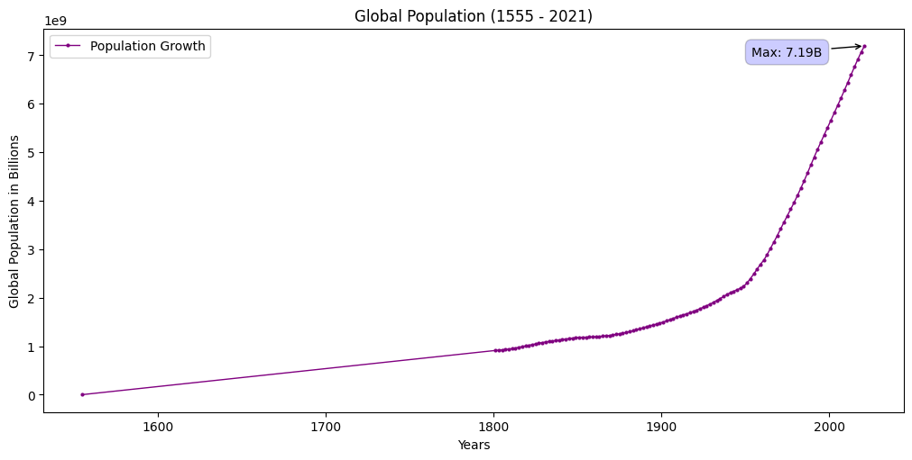

# Create Simple Visualizations

> 📘
The examples below assume that you are using [Jupyter](https://jupyter.org/)

This section demonstrates visualization through charting.
We use the standard convention for referencing the narwhals, pandas, polars, and matplotlib API's:

```python
import narwhals as nw
import pandas as pd
import polars as pl
import matplotlib.pyplot as plt
import csv
```
Import the data for the demonstration

=== "Pandas"
    ```python
    pd_df = pd.read_csv('docs/basics/data/population.csv')

    country_list = []

    with open('docs/basics/data/data.csv', 'r') as file:
        csv_reader = csv.reader(file)
        for row in csv_reader:
            country_list.append(row[0])
    ```

=== "Polars"
    ```python
    pl_df = pl.read_csv('docs/basics/data/population.csv')

    country_list = []

    with open('docs/basics/data/data.csv', 'r') as file:
        csv_reader = csv.reader(file)
        for row in csv_reader:
            country_list.append(row[0])
    ```

We will now write a Data-Agnostic function

```python
    @nw.narwhalify
    def filter_data(df_any):
        df = df_any.rename({"Population (historical estimates)": "Population"})

        # filter out entities that are not countries
        is_country = df_any.with_columns(is_country=nw.col("Entity").is_in(country_list)).filter(nw.col('is_country'))

        return is_country.group_by(['Year']).agg(nw.col('Population').sum().alias('Global Population')).sort("Global Population")
```

Pass either a Pandas or Polars dataframe to the Narwhals agnostic function.

=== "Pandas"
    ```python
    pd_df = filter_data(pd_df)
    print(pd_df)

    # Result
            Year  Global Population
    260   1555                400
    259   1788               4000
    261   1640              40000
    0   -10000            3827272
    1    -9000            4892484
    ..     ...                ...
    254   2017         6915291988
    255   2018         6991447536
    256   2019         7064869525
    257   2020         7133199746
    258   2021         7194273282

    [262 rows x 2 columns]
    ```

=== "Polars"
    ```python
    pl_df = filter_data(pl_df)
    print(pl_df)

    # Result
        shape: (262, 2)
    ┌────────┬───────────────────┐
    │ Year   ┆ Global Population │
    │ ---    ┆ ---               │
    │ i64    ┆ i64               │
    ╞════════╪═══════════════════╡
    │ 1555   ┆ 400               │
    │ 1788   ┆ 4000              │
    │ 1640   ┆ 40000             │
    │ -10000 ┆ 3827272           │
    │ -9000  ┆ 4892484           │
    │ …      ┆ …                 │
    │ 2017   ┆ 6915291988        │
    │ 2018   ┆ 6991447536        │
    │ 2019   ┆ 7064869525        │
    │ 2020   ┆ 7133199746        │
    │ 2021   ┆ 7194273282        │
    └────────┴───────────────────┘
    ```

We can then use matplotlib to plot a graph of the Global population trend from the year 1555 till 2021. To do so, we need to create a dataframe-agnostic Narwhals function.

```python
def plot_population_line(df_any):
    df = nw.from_native(df_any)
    plt.figure(figsize=(10, 5), layout = 'constrained', )
    plt.plot(df['Year'], df['Global Population'], label = 'Population Growth', linewidth=1, marker='o', markersize=2, color='purple')
    plt.ylabel('Global Population in Billions')
    plt.xlabel('Years')
    plt.title('Global Population (1555 - 2021)')
    plt.legend()

    max_population = df['Global Population'].max()
    max_year = df['Year'].max()
    unit = 1000000000

    plt.annotate(f'Max: {max_population/unit:.2f}B', xy=(max_year, max_population), 
        xytext=(-90, -10), textcoords='offset points', ha='left', va='bottom',
        bbox=dict(boxstyle='round,pad=0.5', fc='blue', alpha=0.2),
        arrowprops=dict(arrowstyle='->', connectionstyle='arc3,rad=0'))           

```

Then pass either a Pandas or a Polars dataframe to `plot_population_line(df_any)`

=== "Pandas"
    ```
    plot_population_line(pd_df)
    ```

=== "Polars"
    ```
    plot_population_line(pl_df)
    ```

The resulting graph.

