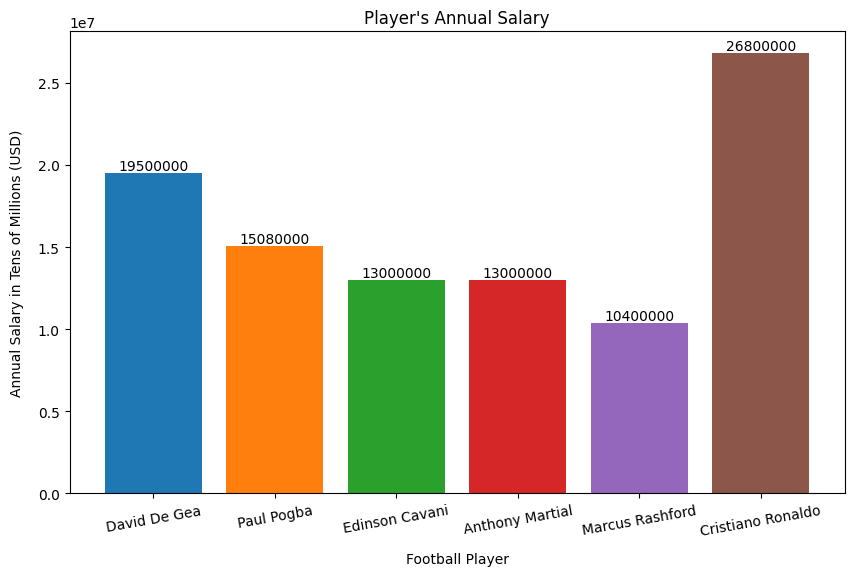

# Create Simple Visualizations

> 📘
The examples below assume that you are using [Jupyter](https://jupyter.org/)

This section demonstrates visualization through charting.
We use the standard convention for referencing the narwhals, pandas, polars, and matplotlib API's:

```python
import narwhals as nw
import pandas as pd
import polars as pl
import matplotlib.pyplot as plt
import csv
```
## Line Plot

Import the data for the demonstration

=== "Pandas"
    ```python
    pd_df = pd.read_csv('docs/basics/data/population.csv')

    country_list = []

    with open('docs/basics/data/data.csv', 'r') as file:
        csv_reader = csv.reader(file)
        for row in csv_reader:
            country_list.append(row[0])
    ```

=== "Polars"
    ```python
    pl_df = pl.read_csv('docs/basics/data/population.csv')

    country_list = []

    with open('docs/basics/data/data.csv', 'r') as file:
        csv_reader = csv.reader(file)
        for row in csv_reader:
            country_list.append(row[0])
    ```

We will now write a Data-Agnostic function. The `filter_data` function processes a data frame by renaming the population column out non-country entities, grouping by year, summing the population for each year, and then sorting the results globally.

```python
    @nw.narwhalify
    def filter_data(df_any):
        df = df_any.rename({"Population (historical estimates)": "Population"})

        # filter out entities that are not countries
        is_country = df_any.with_columns(is_country=nw.col("Entity").is_in(country_list)).filter(nw.col('is_country'))

        return is_country.group_by(['Year']).agg(nw.col('Population').sum().alias('Global Population')).sort("Global Population")
```

Pass either a Pandas or Polars dataframe to the Narwhals agnostic function.

=== "Pandas"
    ```python
    pd_df = filter_data(pd_df)
    print(pd_df)

    # Result
            Year  Global Population
    260   1555                400
    259   1788               4000
    261   1640              40000
    0   -10000            3827272
    1    -9000            4892484
    ..     ...                ...
    254   2017         6915291988
    255   2018         6991447536
    256   2019         7064869525
    257   2020         7133199746
    258   2021         7194273282

    [262 rows x 2 columns]
    ```

=== "Polars"
    ```python
    pl_df = filter_data(pl_df)
    print(pl_df)

    # Result
        shape: (262, 2)
    ┌────────┬───────────────────┐
    │ Year   ┆ Global Population │
    │ ---    ┆ ---               │
    │ i64    ┆ i64               │
    ╞════════╪═══════════════════╡
    │ 1555   ┆ 400               │
    │ 1788   ┆ 4000              │
    │ 1640   ┆ 40000             │
    │ -10000 ┆ 3827272           │
    │ -9000  ┆ 4892484           │
    │ …      ┆ …                 │
    │ 2017   ┆ 6915291988        │
    │ 2018   ┆ 6991447536        │
    │ 2019   ┆ 7064869525        │
    │ 2020   ┆ 7133199746        │
    │ 2021   ┆ 7194273282        │
    └────────┴───────────────────┘
    ```

We can then use matplotlib to plot a graph of the Global population trend from the year 1555 till 2021. To do so, we need to create a dataframe-agnostic Narwhals function.

```python
def plot_population_line(df_any):
    df = nw.from_native(df_any)
    plt.figure(figsize=(10, 5), layout = 'constrained', )
    plt.plot(df['Year'], df['Global Population'], label = 'Population Growth', linewidth=1, marker='o', markersize=2, color='purple')
    plt.ylabel('Global Population in Billions')
    plt.xlabel('Years')
    plt.title('Global Population (1555 - 2021)')
    plt.legend()

    max_population = df['Global Population'].max()
    max_year = df['Year'].max()
    unit = 1000000000

    plt.annotate(f'Max: {max_population/unit:.2f}B', xy=(max_year, max_population), 
        xytext=(-90, -10), textcoords='offset points', ha='left', va='bottom',
        bbox=dict(boxstyle='round,pad=0.5', fc='blue', alpha=0.2),
        arrowprops=dict(arrowstyle='->', connectionstyle='arc3,rad=0'))           

```

Then pass either a Pandas or a Polars dataframe to `plot_population_line(df_any)`

=== "Pandas"
    ```
    plot_population_line(pd_df)
    ```

=== "Polars"
    ```
    plot_population_line(pl_df)
    ```

The resulting graph


## Bar Plot

Import the libraries needed for this demonstration and create a data dictionary.

```python
import narwhals as nw
import matplotlib.pyplot as plt
import pandas as pd
import polars as pl

data = {'Player': ['David De Gea', 'Paul Pogba', 'Edinson Cavani', 'Anthony Martial', 'Marcus Rashford', 'Cristiano Ronaldo'], 'Annual Salary': [19500000, 15080000, 13000000, 13000000, 10400000, 26800000]}
```

We will then define a data-agnostic Narwhals function to plot a Bar Chart using either Pandas or Polars dataframes as input. Note that the logic of the Narwhals function is exactly the same regardless of if Pandas or Polars dataframes are used.

```python
def plot_bar(df_any):
    df = nw.from_native(df_any)
    y = df['Annual Salary']
    x = df['Player']
    
    # Create the bar plot
    plt.figure(figsize=(10, 6))
    colors = ['#1f77b4', '#ff7f0e', '#2ca02c', '#d62728', '#9467bd', '#8c564b']
    plt.bar(x, y, color=colors, width=0.8)

    # Add labels and Title
    plt.xlabel('Football Player', labelpad=(10))
    plt.ylabel('Annual Salary in Tens of Millions (USD)', labelpad=(10))
    plt.title("Player's Annual Salary")

    # Make the xticks diagonal
    plt.xticks(rotation = 10)

    # Add labels on the bars for clarity
    for i in range(len(x)):
            plt.text(i, y[i], y[i], ha = 'center', va = 'bottom')
```

Pass either a Pandas or a Polars dataframe

=== "Pandas"
    ```python
    # Convert the data dictionary to a Pandas dataframe
    pd_df = pd.DataFrame(data)

    # Call the narwhals function
    plot_bar(pd_df)
    ```

=== "Polars"
    ```python
    # Convert the data dictionary to a Polars dataframe
    pl_df = pl.DataFrame(data)

    # Call the narwhals function
    plot_bar(pl_df)
    ```

The resulting plot



## Pie plot
Import the libraries needed for this demonstration and create a data dictionary.

```python
import narwhals as nw
import matplotlib.pyplot as plt
import pandas as pd
import polars as pl

# create dictionary
data = { 
	'Object': ['Bulb', 'Lamp', 'Table', 'Pen', 'Notebook'], 
	'Price': [45, 38, 90, 60, 40] 
}
```

Define a dataframe-agnostic Narwhals function

```python
def plot_pie(df_any):
    df = nw.from_native(df_any)
    plt.pie(df["Price"], labels=df["Object"])
    plt.show() 
```

Create a Pandas or Polars dataframe and pass it to the narwhals function

=== "Pandas"
    ```python
    pd_df = pd.DataFrame(data)
    plot_pie(pd_df)
    ```

=== "Polars"
    ```python
    pl_df = pl.DataFrame(data)
    plot_pie(pl_df)
    ```

The resulting pie plot

