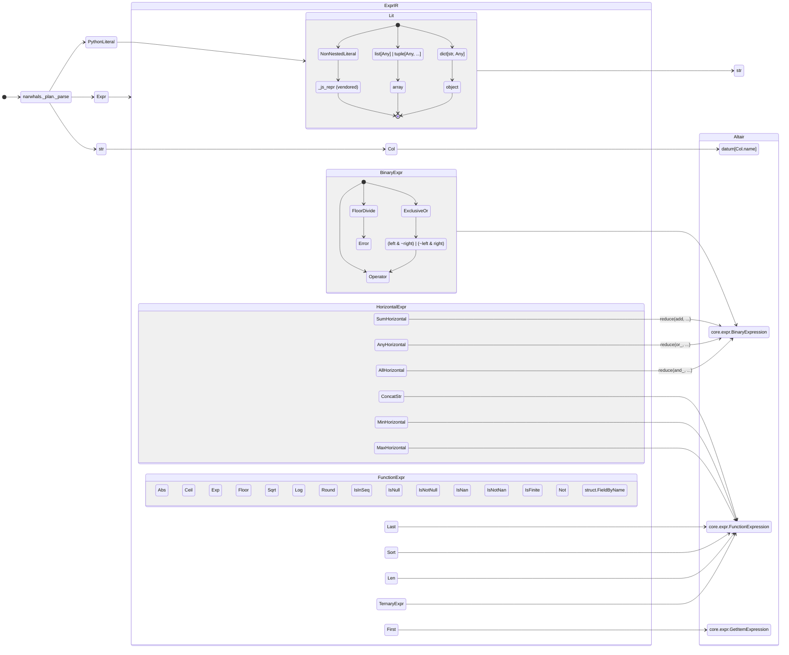

# Use cases

Not convinced by how this benefits our internals and the new kinds of queries we can support?  

**This section is for you**

We'll dive into a few downstream projects and explore:

- New ways they can utilize Narwhals
- Integrations that want for more than Narwhals can (currently) offer
- ... and how they're filling the void

And then we'll close things out with a hopeful look towards new upstream backend support.

## [Vega-Altair](https://github.com/vega/altair)
??? tip "TIL"

    I've worked directly on the existing feature(s) in the past

    - https://github.com/vega/altair/pull/3427
    - https://github.com/vega/altair/pull/3466
    - https://github.com/vega/altair/pull/3653
    - https://github.com/vega/altair/pull/3654
    - https://github.com/vega/altair/pull/3600
    - https://github.com/vega/altair/pull/3664
    - https://github.com/vega/altair/pull/3668

An idea that's got stuck in my head is providing an alternative to [`altair.expr`][]-based expressions [^2].  
*What if* you could write Narwhals expressions directly in an [`altair.Chart`][] instead? 

Considering that we now have a fully-typed [ExprIR](../api-reference-plan/expr-ir/index.md) it should be possible to 
transpile one into the equivalent [string expression syntax] - without using any of the `Compliant*` machinery

### Why?

Although discovery of [Vega Expressions] became *easier* following improved IDE integration (vega/altair#3600), the ergonomics are still not great.

[User Guide/Transform/Calculate]: https://altair-viz.github.io/user_guide/transform/calculate.html

Let's look at the comparison in [User Guide/Transform/Calculate]:


=== "Vega strings"

    The "unsugared" way to write these expressions is entirely within strings

    ``` { .py, .annotate}
    import altair as alt
    import pandas as pd

    data = pd.DataFrame({'t': range(101)})
    alt.Chart(data).mark_line().encode(
        x='x:Q',
        y='y:Q',
        order='t:Q'
    ).transform_calculate(
        x='cos(datum.t * PI / 50)', # (1)!
        y='sin(datum.t * PI / 25)'
    )
    ```

    1.  Good luck memorizing all of [these guys](https://vega.github.io/vega/docs/expressions/) 😳

=== "Altair wrapper"

    If you'd like completions, they come at the cost of verbosity

    ``` { .py, .annotate}
    import altair as alt
    import pandas as pd

    data = pd.DataFrame({'t': range(101)})
    alt.Chart(data).mark_line().encode(
        x='x:Q',
        y='y:Q',
        order='t:Q'
    ).transform_calculate(
        x=alt.expr.cos(alt.datum.t * alt.expr.PI / 50), # (1)!
        y=alt.expr.sin(alt.datum.t * alt.expr.PI / 25)
    )
    ```

    1.  Each expression is close to 2x the number of characters


[fluent-style]: https://en.wikipedia.org/wiki/Fluent_interface

We can improve upon that by writing everything in a consistently [fluent-style]

    
``` { .py, .annotate}
import math
import altair as alt
import narwhals._plan as nw

t_pi = nw.col("t") * math.pi # (1)!
chart = (
    alt.Chart(nw.select(t=nw.int_range(101), eager="polars"))
    .mark_line()
    .encode(x="x:Q", y="y:Q", order="t:Q")
    .transform_calculate(x=(t_pi / 50).cos(), y=(t_pi / 25).sin()) # (2)!
)
chart
```

1.  Sharing a base expression is optional, I found it easier to read
2.  `sin` and `cos` are [currently marked as todo](https://github.com/narwhals-dev/narwhals/blob/76b6a9254dc7994dbb7d092d6bab2d9fedf9093c/docs/plan/mind-the-gap.md?plain=1#L29-L30)

### What?

I got a bit carried away and mapped out what parts of the API can be translated and how:

<!-- TODO @dangotbanned: Replace with a coarser view -->
<!-- TODO @dangotbanned: Maybe have a table for translations? -->

<!-- TODO @dangotbanned: Mention that this describes purely the expression syntax

- Much more is possible via other APIs (`transform_{window,aggregate}`, `encode`)
    - They would use a different set of conversion rules
    - The target is a `SchemaBase` subclass (nested dict vs a string)
-->



### Prior art

[existing syntax]: https://github.com/Quansight/ibis-vega-transform/blob/50e70ad49de1e388b3b852f042553e7dda6499d8/examples/ibis-altair-extraction.ipynb
[just one]: https://github.com/Quansight/ibis-vega-transform/blob/50e70ad49de1e388b3b852f042553e7dda6499d8/ibis_vega_transform/vegaexpr.py

This idea contrasts with another that came before ([Quansight/ibis-vega-transform]).

There, everything was still written using [existing syntax] and really the aim was to improve performance by offloading 
the compute to a database.

That project is an interesting read, but the scope of it dwarfs this idea.
Which is roughly the inverse of [just one] module.


### Concrete example
The [Waterfall Chart] from Altair's example gallery is a glimpse into 
how far you can stretch a few primitives.  

It is impressive, but I don't think how to get there was intuitive [^1]

[^1]: I was the the last one to [refactor it](https://github.com/vega/altair/pull/3544/commits/a681ec53cb57524f1fd347200df94c88c1d151ef) too 😅


!!! tip
    The syntax takes some getting used-to, so check the annotations for Narwhals-equivalent operations


[Waterfall Chart]: https://altair-viz.github.io/gallery/waterfall_chart.html

=== "Current"

    ``` py linenums="1"
    import altair as alt
    import polars as pl

    data = [
        {"label": "Begin", "amount": 4000},
        {"label": "Jan", "amount": 1707},
        {"label": "Feb", "amount": -1425},
        {"label": "Mar", "amount": -1030},
        {"label": "Apr", "amount": 1812},
        {"label": "May", "amount": -1067},
        {"label": "Jun", "amount": -1481},
        {"label": "Jul", "amount": 1228},
        {"label": "Aug", "amount": 1176},
        {"label": "Sep", "amount": 1146},
        {"label": "Oct", "amount": 1205},
        {"label": "Nov", "amount": -1388},
        {"label": "Dec", "amount": 1492}, # (1)!
        {"label": "End", "amount": 0},
    ]
    source = pl.DataFrame(data)

    # Define frequently referenced fields
    amount = alt.datum.amount # (2)!
    label = alt.datum.label
    window_lead_label = alt.datum.window_lead_label
    window_sum_amount = alt.datum.window_sum_amount # (3)!
    
    # Define frequently referenced/long expressions
    calc_prev_sum = alt.expr.if_(label == "End", 0, window_sum_amount - amount) # (4)!
    calc_amount = alt.expr.if_(label == "End", window_sum_amount, amount)
    calc_text_amount = (
        alt.expr.if_((label != "Begin") & (label != "End") & calc_amount > 0, "+", "")
        + calc_amount
    )
    
    # The "base_chart" defines the transform_window, transform_calculate, and X axis
    base = alt.Chart(source).transform_window(
        window_sum_amount="sum(amount)", # (5)!
        window_lead_label="lead(label)",
    ).transform_calculate(
        calc_lead=alt.expr.if_((window_lead_label == None), label, window_lead_label), # (6)!
        calc_prev_sum=calc_prev_sum,
        calc_amount=calc_amount,
        calc_text_amount=calc_text_amount,
        calc_center=(window_sum_amount + calc_prev_sum) / 2,
        calc_sum_dec=alt.expr.if_(window_sum_amount < calc_prev_sum, window_sum_amount, ""),
        calc_sum_inc=alt.expr.if_(window_sum_amount > calc_prev_sum, window_sum_amount, ""),
    ).encode(
        x=alt.X("label:O", axis=alt.Axis(title="Months", labelAngle=0), sort=None)
    )

    color_coding = (
        alt.when((label == "Begin") | (label == "End")) # (7)!
        .then(alt.value("#878d96"))
        .when(calc_amount < 0)
        .then(alt.value("#fa4d56"))
        .otherwise(alt.value("#24a148"))
    )

    bar = base.mark_bar(size=45).encode(
        y=alt.Y("calc_prev_sum:Q", title="Amount"), # (8)!
        y2=alt.Y2("window_sum_amount:Q"),
        color=color_coding,
    )
    # The "rule" chart is for the horizontal lines that connect the bars
    rule = base.mark_rule(xOffset=-22.5, x2Offset=22.5).encode(
        y="window_sum_amount:Q", x2="calc_lead"  # (9)!
    )
    # Add values as text
    text_pos_values_top_of_bar = base.mark_text(baseline="bottom", dy=-4).encode(
        text=alt.Text("calc_sum_inc:N"), y="calc_sum_inc:Q"
    )
    text_neg_values_bot_of_bar = base.mark_text(baseline="top", dy=4).encode(
        text=alt.Text("calc_sum_dec:N"), y="calc_sum_dec:Q"
    )
    text_bar_values_mid_of_bar = base.mark_text(baseline="middle").encode(
        text=alt.Text("calc_text_amount:N"), y="calc_center:Q", color=alt.value("white")
    )

    chart_waterfall = alt.layer(
        bar,
        rule,
        text_pos_values_top_of_bar,
        text_neg_values_bot_of_bar,
        text_bar_values_mid_of_bar,
    ).properties(width=800, height=450)

    chart_waterfall
    ```

    1.  Our input schema is `{"label": String, "amount": Int64}`
    2.  Selecting a column from the input `col("amount")`
    3.  This looks like [`col("amount")`](#__codelineno-3-23), but is a forward reference to [`col("amount").rolling_sum(1).alias("window_sum_amount")`](#__codelineno-3-39)
    4.  A conditional expression  
        `when(col("label") == lit("End")).then(0).otherwise(col("window_sum_amount") - col("amount"))`
    5.  `col("amount").rolling_sum(1).alias("window_sum_amount")`
    6.  Expressions in this block are similar to `with_columns(**named_exprs)`
    7.  I'm responsible for introducing this and it is a bit frankenstein-esque.  
        
        - It isn't the same as `alt.expr.if_`, although they can both be used in *some* of the same places
        - It also differs from `pl.when` in how literals are parsed
    8. Referencing the results from an earlier `transform_calculate`
    9. Column names are suffixed to provide [something close to data types](https://altair-viz.github.io/user_guide/encodings/index.html#shorthand-description)
       
       - This is not required when referencing a column in the schema (which is inferred)
       - But the inferred types do not propagate between transformations/expressions

=== "With Narwhals"

    <!-- TODO @dangotbanned: Add this after cleaning up the experiments from this branch -->
    ``` py
    ...
    ```


[string expression syntax]: https://altair-viz.github.io/user_guide/interactions/expressions.html
[Vega Expressions]: https://vega.github.io/vega/docs/expressions/
[Quansight/ibis-vega-transform]: https://github.com/Quansight/ibis-vega-transform

[^2]: See also [Vega Expressions]


## Strings -> Narwhals

<!-- TODO @dangotbanned: Discuss what it is they're doing and why -->

I found 4 projects doing some variation of this ...

### [Marimo](https://github.com/marimo-team/marimo)
- [strings to narwhals](https://github.com/marimo-team/marimo/blob/80d52cbabe4a5232573de3b0b430332531650668/marimo/_plugins/ui/_impl/dataframes/transforms/handlers.py)

### [Metaxy](https://docs.metaxy.io/stable/guide/concepts/filters/)
- https://github.com/narwhals-dev/narwhals/issues/3310
- [strings -> sqlglot -> (small) custom ir -> narwhals](https://github.com/anam-org/metaxy/blob/main/src/metaxy/models/filter_expression.py)


### [Frame Search](https://github.com/williambdean/frame-search)
- [strings -> lark -> custom ir -> narwhals](https://github.com/williambdean/frame-search/blob/399d5c0c86f66b22d8daa41bd691f47d135b7e35/src/frame_search/parse.py)

### [Laktory](https://github.com/okube-ai/laktory)
- [strings -> sqlglot -> narwhals](https://github.com/okube-ai/laktory/blob/27040080ac1da2e3705c923ae25ee6feb393e4f4/laktory/sqlparser.py)


## Selectors
<!-- TODO @dangotbanned: Why do they have it? -->
- [checkedframe](https://github.com/CangyuanLi/checkedframe) has a [full re-implementation selectors](https://github.com/CangyuanLi/checkedframe/blob/0519999883db3a9aa2bb80250fe10d57fae44e2f/src/checkedframe/selectors.py)

## New backends?
<!-- TODO @dangotbanned: tidy up-->

Examples that come from comments/issues

### [datafusion-python](https://github.com/apache/datafusion-python)
Support `datafusion` as a plugin:

-  by building the plan with `narwhals`
-  converting that plan to datafusion
-  (optionally) optimize it
-  execution should be already solved?

#### Related
- https://github.com/narwhals-dev/narwhals/issues/3225
- https://datafusion.apache.org/python/autoapi/datafusion/expr/index.html
- https://datafusion.apache.org/python/autoapi/datafusion/plan/index.html#datafusion.plan.LogicalPlan


### [SQLGlot](https://sqlglot.com/sqlglot.html)
Similar story to [datafusion](#datafusion-python)

> Nevertheless the fact that Ibis is still required as an SQL generating API kind of feels like a Rube-Goldberg contraption.  
> It would be nice if Narwhals could deal with SQLGlot directly.

#### Related
- https://github.com/narwhals-dev/narwhals/issues/2515
- https://github.com/narwhals-dev/narwhals/issues/2515#issuecomment-4322249216
